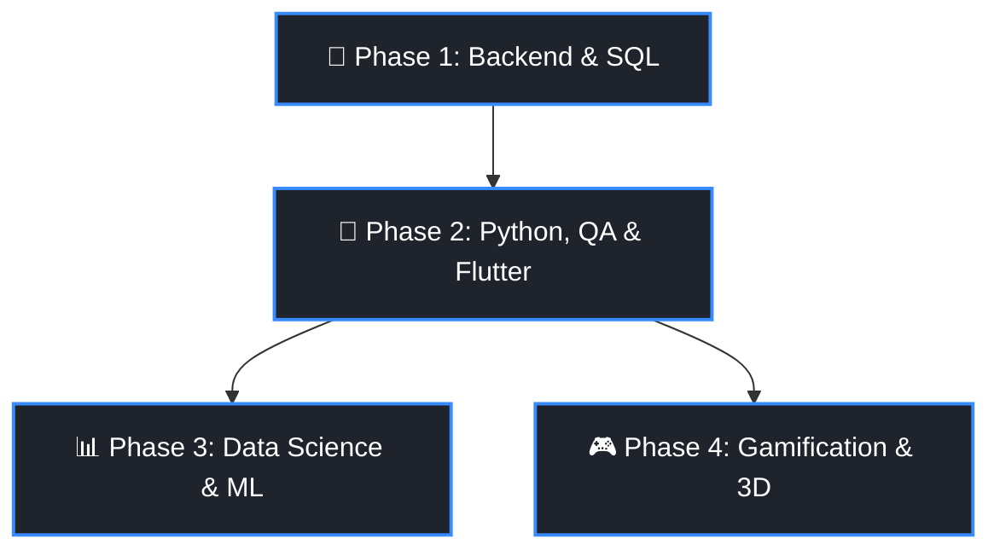

# 👩‍💻 Maria | Frontend & Fullstack (Node.js) Developer

Hi there! My name is Maria. I build responsive, high-performance web applications with a strong emphasis on clean code, modern architecture, and thoughtful UX/UI.

Leveraging my professional background in **Economics (including Advanced Mathematics)** and **Law**, I am highly skilled at deeply analyzing complex requirements, structuring robust business logic, and approaching architectural design systematically. I am proactive in making decisions, taking full responsibility for results and team outcomes, and I maintain high emotional stability in any crisis situation.

My portfolio

https://portfolio-maria-prusakova.netlify.app/
---

## 🛠 Hard Skills

*   **Frontend:** HTML5, CSS3 / SASS, JavaScript (ES6+), TypeScript, React, Redux Toolkit
*   **Animation & Design:** GSAP, Figma, Mobile-first approach
*   **Backend & DB:** Node.js, Express.js, MongoDB
*   **Architecture & Testing:** Feature-Sliced Design (FSD), Manual Testing
*   **Actively Learning:** Flutter / Dart, SQL (PostgreSQL), Test Automation (Python)

---

## 🚀 My Projects

### 🍳 [Lazy Cooking](https://lazy-cooking.netlify.app/)
A lightweight web application designed for quick recipe discovery and minimal-effort meal planning.
*   **Key Features:** High performance, clean code, and blazing fast media assets loading optimized via Cloudinary cloud image storage.
*   **Demo:** [lazy-cooking.netlify.app](https://lazy-cooking.netlify.app/)
*   **Code:** [github.com/pusliaMary/Easy-cooking-frontend](https://github.com/pusliaMary/Easy-cooking-frontend.git)

### 🎨 [Portfolio Designer (Olesya Martin)](https://designer-olesya-martin.netlify.app/)
A commercial portfolio application developed for a professional designer.
*   **Key Features:** Complex user experience logic implemented seamlessly in the gallery and portfolio views. Features a secure, authenticated admin dashboard enabling the owner to fully manage all content.
*   **Demo:** [designer-olesya-martin.netlify.app](https://designer-olesya-martin.netlify.app/)
*   **Code:** [github.com/pusliaMary/Designer-frontend](https://github.com/pusliaMary/Designer-frontend.git)

### 🌱 [EcoStore & EcoEducationPlatform](https://shop-eco-friendly.netlify.app/)
A comprehensive educational eco-platform built to empower individuals to measure and reduce their ecological footprint.
*   **Key Features:** Dynamic ecological breakdown modules, empirical and practical green lifestyle solutions, in perspective - eco-store and an interactive video game concept upcoming.
*   **Demo:** [shop-eco-friendly.netlify.app](https://shop-eco-friendly.netlify.app/)
*   **Code:** [github.com/pusliaMary/EcoStore](https://github.com/pusliaMary/EcoStore.git)

### 🎯 [Self-Accountability App (Progress)](https://progress-accountability.netlify.app/EasyMode)
A personal productivity and awareness tracker designed to facilitate structured life planning—ranging from straightforward daily to-do checklists to broad, long-term personal strategy management.
*   **Demo:** [progress-accountability.netlify.app/EasyMode](https://progress-accountability.netlify.app/EasyMode)
*   **Code:** [github.com/pusliaMary/Progress](https://github.com/pusliaMary/Progress.git)

### 📈 [Personal Investment App (Couple Investment)](https://couple-investment.netlify.app/)
A financial investment tracker built to visually demonstrate the massive compounding potential of shared long-term capital investments. Try calculating across a 12+ year horizon to see the inflection point where accumulated interest surpasses actual out-of-pocket contributions.
*   **Demo:** [couple-investment.netlify.app](https://couple-investment.netlify.app/)
*   **Code:** [github.com/pusliaMary/Couple-Investment](https://github.com/pusliaMary/Couple-Investment.git)

---

## 🎯 Strategic Learning Roadmap (2026–2027)

### 🗓 Phase 1: Advanced Backend & Relational Databases (Focus: Months 1–3)
*   **Technologies:** PostgreSQL, Prisma ORM / Sequelize, Clean Architecture (Clean Architecture / DDD in Node.js ecosystems), Jest / Vitest (Unit Testing).
*   **Hands-on Application:** Migrate underlying database schemas for `Couple Investment` and `Progress` from MongoDB to PostgreSQL to guarantee strict relational data integrity. Cover all financial calculation logic with robust unit tests.

### 🐍 Phase 2: Python, Automation & Mobile Development (Focus: Months 3–6)
*   **Technologies:** Dart & Flutter, Python, PyTest, Playwright.
*   **Hands-on Application:** Re-engineer the mobile app for `Lazy Cooking` using Flutter with an emphasis on smooth, native UI transitions. Populating the app with cooking recipes tailored around a "monkey task" methodology — meaning you receive your food delivery, put on your headphones or a movie, and cook via super straightforward steps accessible to anyone.

### 📊 Phase 3: Data Science & Machine Learning (Focus: Horizon 2027)
*   **Technologies:** NumPy, Pandas, Matplotlib, Seaborn, Scikit-Learn.
*   **Hands-on Application:** Conduct exploratory data analysis (EDA) on environmental datasets to embed interactive analytics dashboards directly into `EcoStore`. Train a predictive forecasting engine inside `Couple Investment` driven by historical financial asset trends.

### 🎮 Parallel Track: Gamification & Rich UI Animations
*   **Technologies:** WebGL, Three.js, Phaser.js, PixiJS, React Three Fiber (R3F) (Focus: Horizon 2026)
*   **Hands-on Application:** Design and program a fully functional, highly engaging 2D Canvas or 3D interactive web game mapped to eco-education targets inside the `EcoStore` application ecosystem.

---

## 📈 Progress Checklist

- [x] Foundation Fullstack Stack (HTML5, CSS3/SASS, JS, React/Redux Toolkit, Node.js, Express, MongoDB)
- [x] Feature-Sliced Design (FSD) Architectural Methodology
- [ ] Advanced SQL Querying & Relational Database Design (PostgreSQL)
- [ ] End-to-End Browser Automation (Python + Playwright)
- [ ] Cross-Platform Mobile Software Engineering (Flutter)
- [ ] Data Science & Core Machine Learning Foundations (Pandas, Scikit-Learn)
- [ ] Interactive 3D Web Rendering (Three.js / Canvas API)

---

## 🧠 Soft Skills & Core Traits
*   High learning velocity, acute analytical mindset, and a genuine passion for dissecting complex engineering bottlenecks.
*   Reasoned, objective decision-making paired with a natural accountability for team velocity and delivery metrics.
*   Proven leadership experience managing diverse groups of individuals (outside the traditional tech environment).
*   Empathic, resilient, persistently curious, optimistic, and highly grounded during tight deployment sprints or live incidents.

## 🗣 Languages
*   **Russian:** Native speaker
*   **English:** B2 / C1 (Proficient—full capacity for reading technical specs, technical writing, and live business collaboration)
*   **French:** A1 (Basic introductory communication)

## 📬 Connect with me
*   **Email:** pusliaprus@gmail.com
*   **Telegram:** https://t.me/mashaavdp
*   **GitHub:** https://github.com/pusliaMary
*   **Portfolio:** https://portfolio-maria-prusakova.netlify.app/
