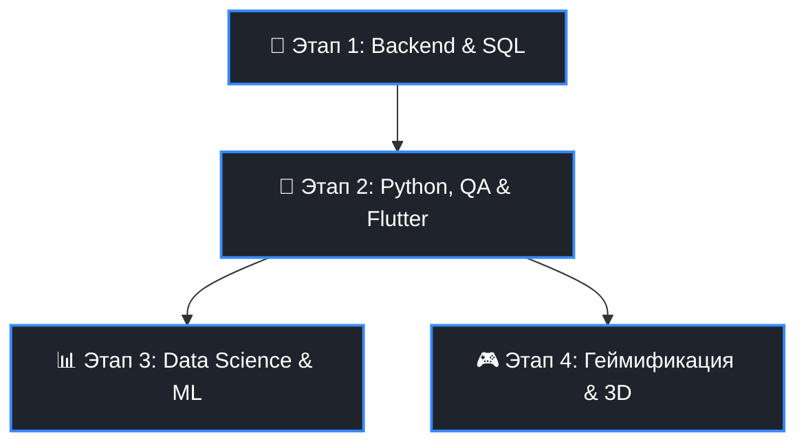

# 👩‍💻 Maria | Frontend & Fullstack (Node.js) Developer

Привет! Меня зовут Мария. Я создаю отзывчивые, быстрые веб-приложения с упором на чистый код, современную архитектуру и продуманный UX/UI. 

Благодаря моему бэкграунду в **экономике (включая высшую математику)** и **юриспруденции**, я умею глубоко анализировать требования, выстраивать бизнес-логику и подходить к решению архитектурных задач системно. Я не боюсь принимать решения, брать на себя ответственность за результат и остаюсь стабильной в любых кризисных ситуациях.

---

## 🛠 Hard Skills

*   **Frontend:** HTML5, CSS3 / SASS, JavaScript (ES6+), TypeScript, React, Redux Toolkit
*   **Анимация и дизайн:** GSAP, Figma, Mobile-first
*   **Backend & DB:** Node.js, Express.js, MongoDB
*   **Архитектура & Тестирование:** Feature-Sliced Design (FSD), Ручное тестирование (Manual Testing)
*   **В процессе активного изучения:** Flutter / Dart, SQL (PostgreSQL), Автоматизация тестирования (Python)

---

## 🚀 Мои проекты

### 🍳 [Lazy Cooking](https://lazy-cooking.netlify.app/)
Легковесное веб-приложение для быстрого поиска рецептов и планирования меню с минимальными усилиями. 
*   **Особенности:** Высокая производительность, чистый код, быстрая загрузка медиа-ресурсов благодаря оптимизированному облачному хранилищу изображений (Cloudinary).
*   **Демо:** [lazy-cooking.netlify.app](https://lazy-cooking.netlify.app/)
*   **Код:** [github.com/pusliaMary/Easy-cooking-frontend](https://github.com/pusliaMary/Easy-cooking-frontend.git)

### 🎨 [Portfolio Designer (Olesya Martin)](https://designer-olesya-martin.netlify.app/)
Коммерческое приложение-портфолио для профессионального дизайнера.
*   **Особенности:** Сложная логика взаимодействия с пользователем в галерее и портфолио. Разработана защищенная панель администратора с авторизацией для полного управления контентом владельцем сайта.
*   **Демо:** [designer-olesya-martin.netlify.app](https://designer-olesya-martin.netlify.app/)
*   **Код:** [github.com/pusliaMary/Designer-frontend](https://github.com/pusliaMary/Designer-frontend.git)

### 🌱 [EcoStore & EcoEducationPlatform](https://shop-eco-friendly.netlify.app/)
Комплексная образовательная эко-платформа, призванная научить людей снижать свой экологический след.
*   **Особенности:** Разбор экологических проблем, практические эмпирические решения, в будущем - полноценный эко-магазин и интерактивный геймифицированный концепт экологической видеоигры.
*   **Демо:** [shop-eco-friendly.netlify.app](https://shop-eco-friendly.netlify.app/)
*   **Код:** [github.com/pusliaMary/EcoStore](https://github.com/pusliaMary/EcoStore.git)

### 🎯 [Self-Accountability App (Progress)](https://progress-accountability.netlify.app/EasyMode)
Приложение для повышения личной эффективности и осознанности, помогающее гибко планировать жизнь — от простых ежедневных списков дел до масштабных долгосрочных стратегий управления целями и задачами.
*   **Демо:** [progress-accountability.netlify.app/EasyMode](https://progress-accountability.netlify.app/EasyMode)
*   **Код:** [github.com/pusliaMary/Progress](https://github.com/pusliaMary/Progress.git)

### 📈 [Personal Investment App (Couple Investment)](https://couple-investment.netlify.app/)
Финансово-инвестиционное приложение, наглядно демонстрирующее работу сложных процентов и силу долгосрочного совместного инвестирования. Попробуйте расчет на горизонте 12+ лет, когда сумма полученных процентов превысит вложения
*   **Демо:** [couple-investment.netlify.app](https://couple-investment.netlify.app/)
*   **Код:** [github.com/pusliaMary/Couple-Investment](https://github.com/pusliaMary/Couple-Investment.git)

---

## 🎯 Стратегический Roadmap развития (2026–2027)

### 🗓 Этап 1: Продвинутый Backend & Реляционные БД (Фокус: 1–3 мес)
*   **Технологии:** PostgreSQL, Prisma ORM / Sequelize, Чистая архитектура (Clean Architecture / DDD на Node.js), Jest / Vitest (Unit-тесты).
*   **Практика:** Перенос структуры баз данных проектов `Couple Investment` и `Progress` с MongoDB на PostgreSQL для обеспечения жесткой целостности данных. Покрытие финансовой логики юнит-тестами.

### 🐍 Этап 2: Python, Автоматизация & Mobile (Фокус: 3–6 мес)
*   **Технологии:** Dart & Flutter, Python, PyTest, Playwright.
*   **Практика:** Разработка мобильного приложения `Lazy-cooking` на Flutter с упором на плавные нативные UI-анимации. Наполнение приложения рецептами по методике monkey task - получила доставку, надела наушники или включила фильм - готовишь по простейшим шагам, доступным даже обезьянке.

### 📊 Этап 3: Data Science & Machine Learning (Фокус: 2027 год)
*   **Технологии:** NumPy, Pandas, Matplotlib, Seaborn, Scikit-Learn.
*   **Практика:** Интеграция интерактивных графиков и результатов разведочного анализа данных (EDA) экологических показателей в `EcoStore`. Создание модели прогнозирования накоплений в `Couple Investment` на основе исторических финансовых трендов.

### 🎮 Параллельный трек: Геймификация & Сложная анимация
*   **Технологии:** WebGL, Three.js,  Phaser.js, PixiJS, React Three Fiber (R3F).
*   **Практика:** Создание полноценной интерактивной 3D или Canvas микро-игры на экологическую тематику внутри платформы `EcoStore`.

---

## 📈 Чек-лист прогресса

- [x] Базовый Fullstack стек (HTML, CSS/SASS, JS, React/Redux Toolkit, Node.js, Express, MongoDB)
- [x] Архитектурная методология Feature-Sliced Design (FSD)
- [ ] Глубокое понимание SQL и проектирования реляционных БД (PostgreSQL)
- [ ] Автоматизация веб-тестирования (Python + Playwright)
- [ ] Кроссплатформенная мобильная разработка (Flutter)
- [ ] Анализ данных и основы машинного обучения (Pandas, Scikit-Learn)
- [ ] Создание 3D-сцен в браузере (Three.js / Canvas)

---

## 🧠 Soft Skills & Качества
*   Высокая скорость обучения, аналитический склад ума и страсть к решению сложных инженерных задач.
*   Разумность в принятии решений, умение брать ответственность за результат и команду.
*   Опыт управления группами людей (не в ИТ).
*   Эмпатичность, упорство, психологическая устойчивость и стабильность в кризисных ситуациях.

## 🗣 Языки
*   **Русский:** Родной
*   **Английский:** B2 / C1 (Свободное владение, чтение тех. документации, коммуникация)
*   **Французский:** A1

## 📬 Контакты
*   **Email:** pusliaprus@gmail.com
*   **Telegram:** https://t.me/mashaavdp
*   **GitHub:** https://github.com/pusliaMary
*   **Portfolio:** https://portfolio-maria-prusakova.netlify.app/
